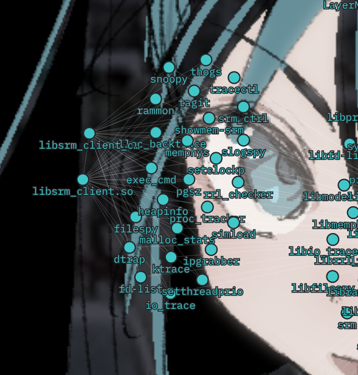
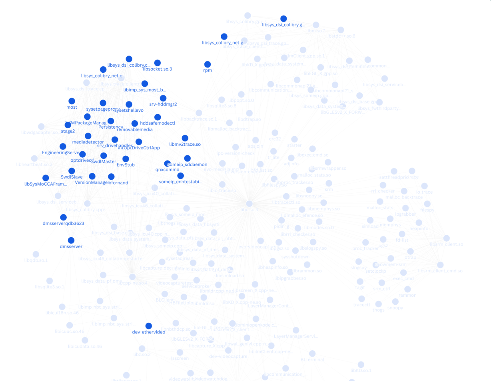
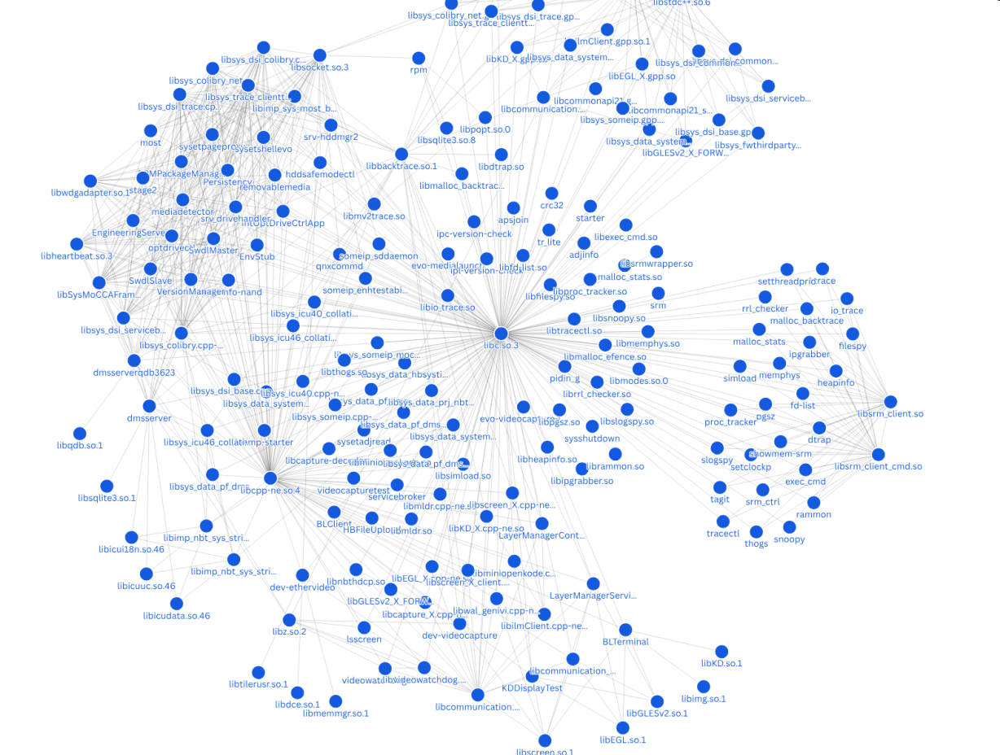

# library-dependency-visualization

These are scripts and chunks of data for testing out black-box library dependency visualization/graphing.

The goal of these tools is to allow for identification of potentially interesting or even vulnerable functionality within black box firmware binaries. If you see a number of binaries or libraries that don't seem to be referenced by the wider system, it could point to areas of 3rd party code that may be interesting to hunt for vulnerabilities in.

As an example, in the above photo you can see a cluster of functionality that appears to be almost entirely separate from all other scanned binaries and libraries.

This may point to a chunk of code developed by a 3rd-party, or included in the OS for a single and very specific purpose. Usually, specific-purpose code like this has a higher likelihood of being:

1. Custom, and therefore not well-tested.
2. Proprietary, and therefore not well-tested.
3. Developed by a third party, and therefore not well-tested.

Often times, these chunks of functionality can be very interesting to look at for potential security issues. This graphing technique makes them easy to locate.

As an additional technique, you can also hover shared libraries to find all other binaries or libraries that reference them. In the below screenshot, every binary that uses `libsocket.so.3` is highlighted.

## Theming...

Admittedly, this data is much easier to parse without goth hatsune miku 🥀

## Disclaimer

The scripts and data here are in development/WIPs, I do not recommend using any of them for serious purposes. These are simply fun tech demos!

## Future Goals?

**Long term goal**: I'd like to incorporate this functionality into the [elf-analyzer](https://github.com/ttepatti/elf-analyzer) tool.
